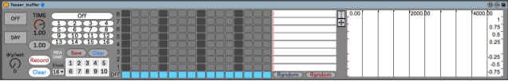

# Tesser_buffer

This device allows to save and recall bits of audio.

---

### Credits

This M4L device is largely based on [mushroomtheory](https://mushroomtheory.gumroad.com/?_ga=2.239974795.947548069.1647069335-689921625.1647069335&sort=featured)'s [SampleBeat1](https://mushroomtheory.gumroad.com/l/samplebeat1?fbclid=IwAR2EfIWWpHBYdjzJmB3-A36_lFzdFF-R2DHY8YRTA5TMn2j11ve5956jMhE) device.

---

## Environment

This Patch is part of the [TesserAkt environment](https://bitbucket.org/AdrianArtacho/tesserakt/src/master/).

____

## To-Do

* document how to use it
